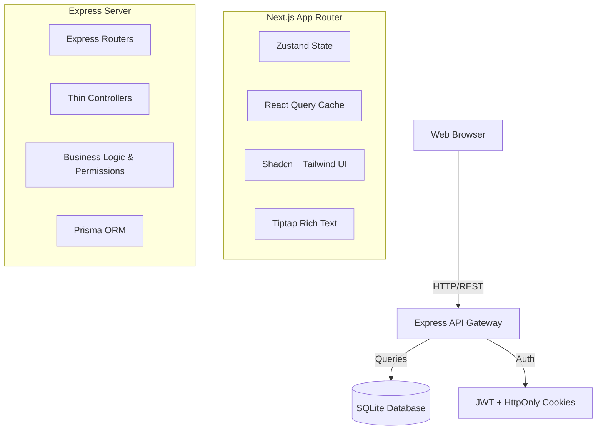
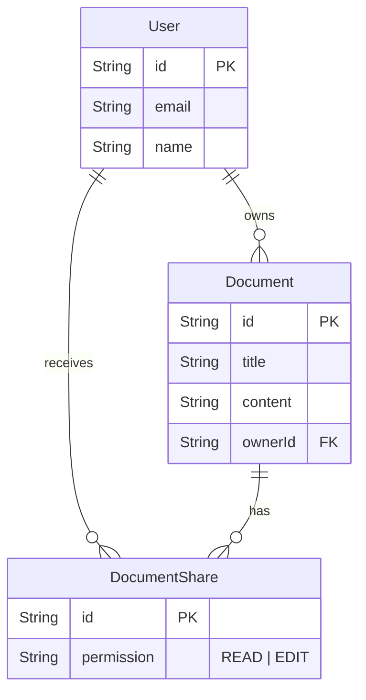

# Architecture Overview

This project implements a clean, feature-driven architecture across both the frontend (Next.js App Router) and backend (Express + Prisma).

## High-Level Architecture

## Feature-Based Folder Structure
Instead of a monolithic layered architecture (e.g. all controllers together, all services together), both codebases group files by **Feature**.

### Backend Features Example: `src/modules/documents`
- `document.schema.ts` (Zod schemas)
- `document.service.ts` (Business logic)
- `document.controller.ts` (Request/Response orchestration)
- `document.routes.ts` (Express routing)

### Frontend Features Example: `src/features/documents`
- `/api/` (Axios calls)
- `/hooks/` (React Query mutations)
- `/components/` (Feature-specific UI)
- `/store/` (Zustand state slices)

## Database Schema

